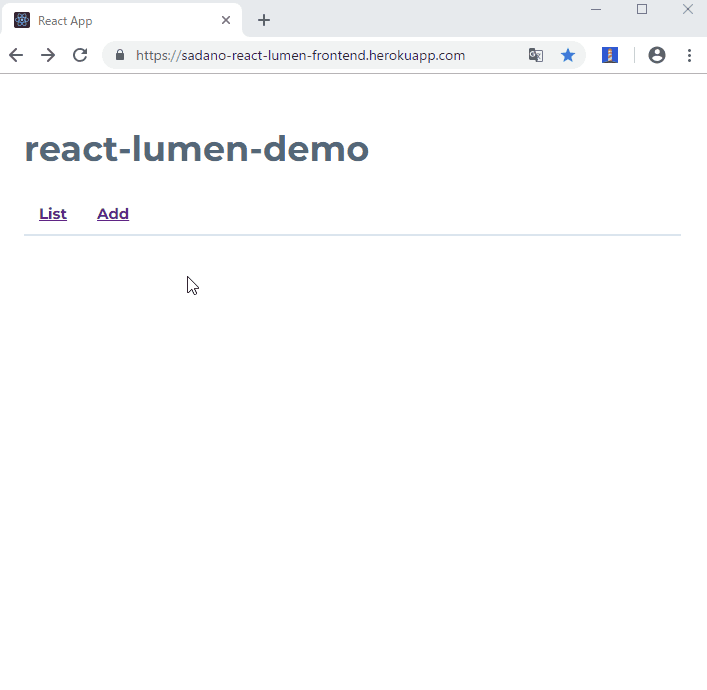

# react-lumen-demo

フロントエンドにReact.js、バックエンドのAPIサーバにlumenを用いたTODOリストアプリケーションです。

デモアプリケーションをherokuにデプロイしています。

[react-lumen-demo](https://sadano-react-lumen-frontend.herokuapp.com/)

## フレームワーク

- フロントエンド：React.js
- バックエンド：Lumen

## データベース

- Heroku：Postgres

## ライブラリ

- ルーティング：react-router-dom v4
- CSS：[siimple](https://www.siimple.xyz/)
- ORM：Eloquent
- Redux等のState管理ライブラリは用いていません。

## 特徴

- 自動発行した仮ユーザIDをlocalstrageに保存している為、ブラウザ毎にTODOの内容が記録されます。

## License

MIT License.